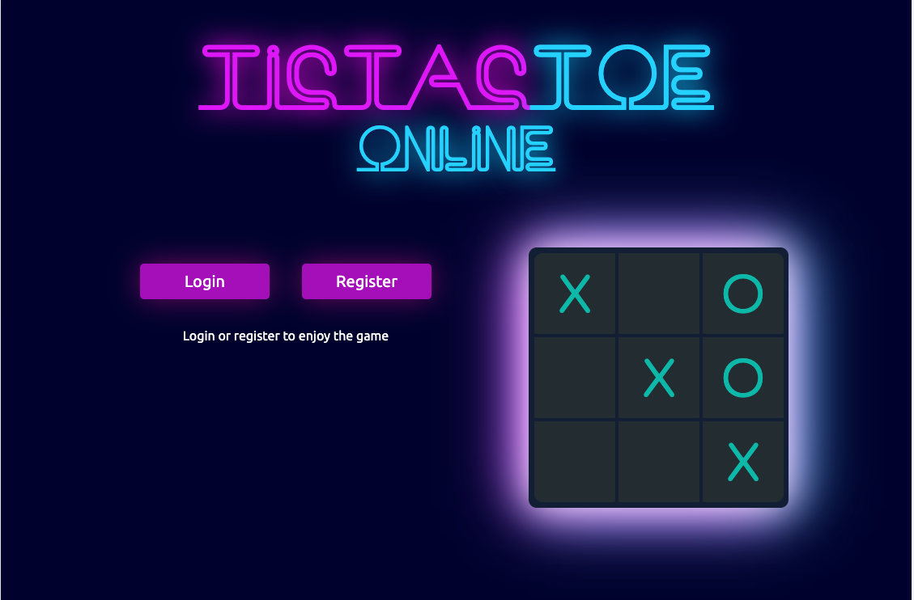
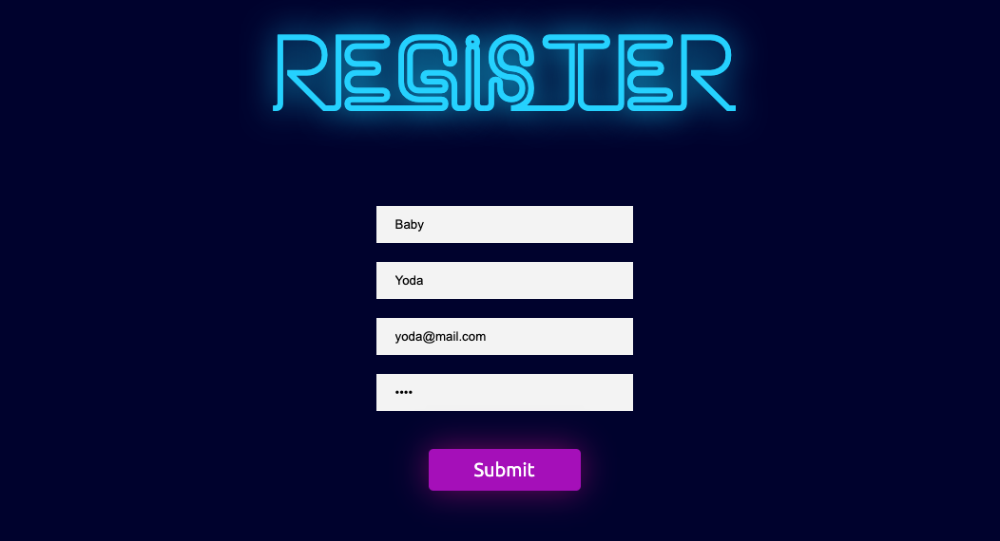
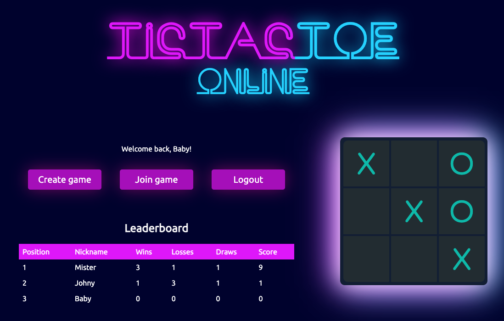
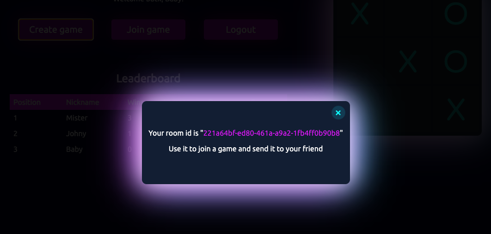
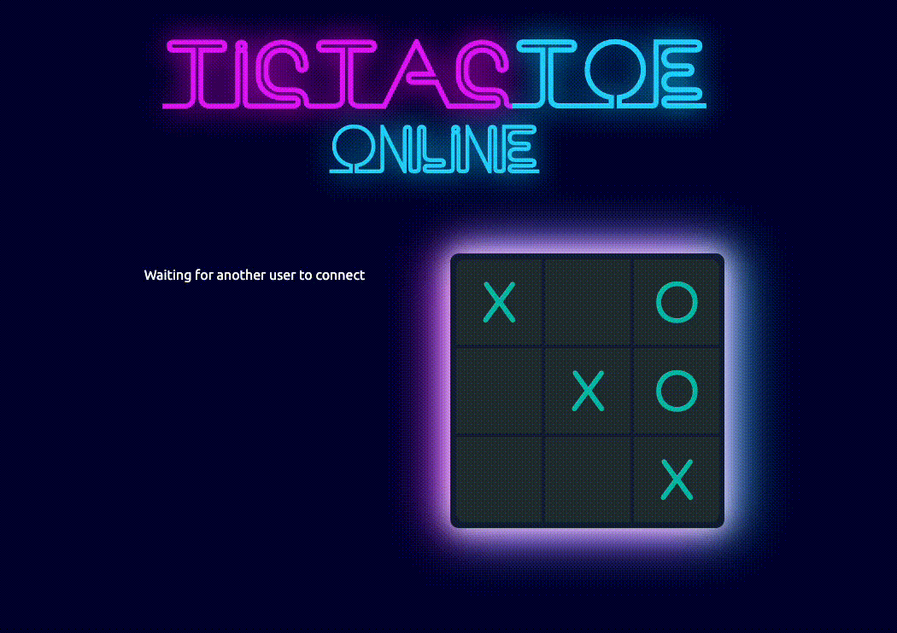
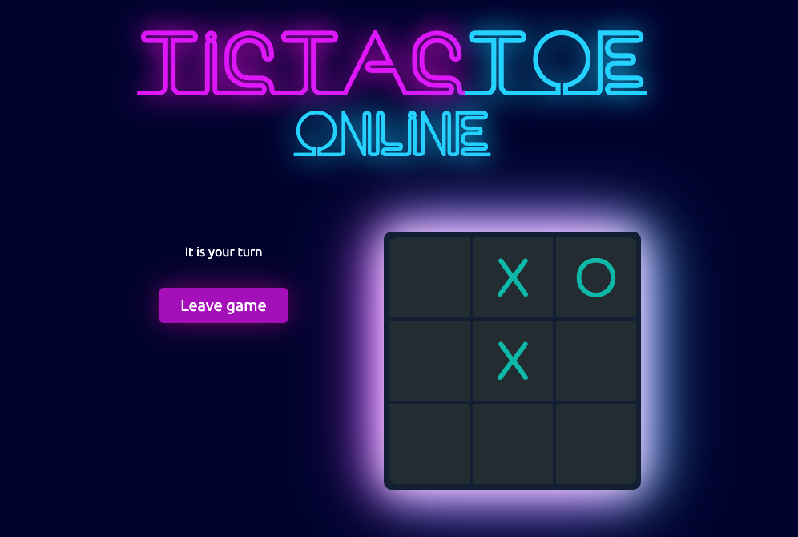
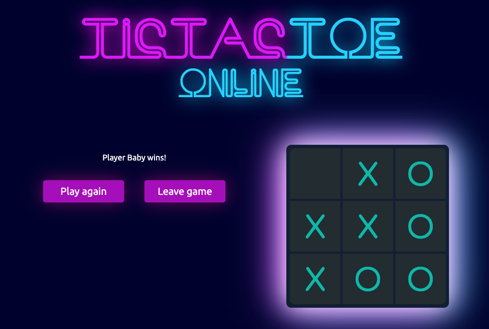

## Tic-Tac-Toe game with load balancer, state manager and websockets

### Overview

This project is written without using any frontend and backend libraries such as React.js or Express or
whatever. This is done intentionally to show that is not that hard to write a backend on pure Node. 
Same goes with frontend, but, frankly speaking, I would rather use something like React. Webpack
config was probably the hardest task for me. Additionally I haven't used classes syntax, just for fun.

### Technologies and tools

- JavaScript - main programming language
- Node.js - runtime for application
- PostgreSQL - main database for storing user data
- Redis - as a database for storing game session data
- Nginx - load balancer
- Docker - containerization tool
- Docker Compose - used to run two instances of main app and separate database all with one command
- Webpack - to bundle client code
- HTML/CSS - for styling and layout of webpages

### Steps to run project

1. Clone repository
2. Cd into project directory
3. Run **docker compose up**
4. Go to **localhost:8080** (nginx will proxy to 1111 or 2222)

### Steps to play the game

1. Register  

2. Next step is to create a game and send the game id to your friend (or to yourself in incognito window)
    

3. Join the game with game id and have fun 
    
